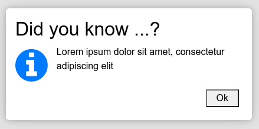

# simplydialogs
A small collection of standard dialogs: ```alert()```, ```confirm()```, ```error()```, ```info()```, ```bell()``` and ```wait()```. 
Built with ES6 and unicode, utilizing the native ```<dialog>``` HTML element. Works in all modern browsers. Tested with Chrome, 
Opera, Firefox and Edge (Linux & Windows 10). 

Use simplydialogs if you just need some dialogs on a minimalistic webpage - or want a quick alternative to the built-in dialogs or modals 
provided by your favourite framework, like Bootstrap, Tailwind or similar. You customize the layout so it get the look of your theme / framework. 

* No dependencies; using native &lt;dialog> element and unicode</li>
* Truly blocking interaction with background
* Stays in center of viewport, adjusted to message size, stays in focus while scrolling
* Returns promises
* Support keyboard / mouse the right way
* Customizeable
* Neat exploding / imploding effect without exaggerating
* No forced styling (beyond very basics), adopts the current "theme"
* Small footprint, JS + CSS less than 10k minified; Without beep sound ~5k.

## Dialogs
<table>
<tr>
<th>Type</th>
<th>Sample</th>
<th>Remarks</th>
</tr>
<tr>
<td>

```alert()```

</td>
<td></td>
<td>

```javascript
Dlg.alert('Lorem ipsum ...')
```

Returns promise, ex: 

```javascript
Dlg.alert('Lorem ipsum ...').then(answer => { 
  console.log(answer) //always true 
})
```

</td>
</tr>
<tr>
<td>

```confirm()```

</td>
<td></td>
<td>

Returns promise, ex: 

```javascript
Dlg.confirm('Lorem ipsum ...').then(answer => { 
  console.log(answer) //true or false
})
```
</td>
</tr>
<tr>
<td>

```information()```<br>```info()```

</td>
<td></td>
<td>

Same as ```alert()```

</td>
</tr>
<tr>
<td>

```error()```

</td>
<td></td>
<td>

Same as ```alert()```

</td>
</tr>
<tr>
<td>

```bell()```

</td>
<td></td>
<td>

Same as ```alert()```

Produces a "beep", if you not want the beep, use ```dialogs.wb.min.js```. The embedded ```data:audio/wav;base64``` takes up around 4k.  

</td>
</tr>
<tr>
<td>

```wait()```

</td>
<td></td>
<td>

Does not return a promise, but a function you can close the wait dialog with : 

```javascript
const wait = Dlg.wait('Lorem ipsum ...')
//
//do something in code
//
wait.close()
```

</td>
</tr>
</table>

## Usage
Include the script and CSS. A version without beep are named ```dialogs.wb.*```. That reduces the code size about ~50% minified.

```html
<script src="path/to/simplydialogs/dist/dialogs.min.js"></script>
<link rel="stylesheet" type="text/css" href="path/to/simplydialogs/dist/dialogs.min.css">
```

That makes a SimplyDialogs function available. For convenience, create a shorthand alias :

```javascript
const Dlg = SimplyDialogs
Dlg.alert('Lorem ipsum dolor sit amet, consectetur adipiscing elit')
Dlg.error('Lorem ipsum dolor sit amet, consectetur adipiscing elit')
Dlg.confirm('Lorem ipsum dolor sit amet, consectetur adipiscing elit')
Dlg.info('Lorem ipsum dolor sit amet, consectetur adipiscing elit')
Dlg.bell('Lorem ipsum dolor sit amet, consectetur adipiscing elit')
```

To wait for user response and do something according to what it is, use the returned promise :

```javascript
Dlg.confirm('Lorem ipsum dolor sit amet, consectetur adipiscing elit').then(answer => {
  console.log('The answer was ' + (answer ? 'Yes' : 'No'))
})
```

## Change defaults
All dialogs have som basic defaults which can be altered

```javascript
let defaults = {
  headers: {
    alert: 'Alert',
    error: 'Error',
    confirm: 'Confirm',
    information: 'Information',
    bell: 'Notice'
  },
  icons: {
    alert: '⚠',
    error: '⛔',
    confirm: '✔️',
    information: '💡',
    bell: '🔔',
    wait: '⚙️'
  },
  buttons: {
    captions: {
      ok: 'Ok',
      cancel: 'Cancel',
      yes: 'Yes',
      no: 'No'
    },
    classes: {
      ok: '',
      cancel: '',
      yes: '',
      no: ''
    }
  }
}
```
### DEFAULTS examples

If you want to change the confirm yes / no buttons to for example something different in spanish:

```javascript
Dlg.DEFAULTS.buttons.captions.yes = 'Aceptar'
Dlg.DEFAULTS.buttons.captions.no = 'Cancelar'
```
If you want to use an image instead of the default unicode symbol, for example a nicer information glyph :

```javascript
Dlg.DEFAULTS.icons.information = ''
```
If you want to show a bootstrap styled button instead of a neutral standard button :

```javascript
Dlg.DEFAULTS.buttons.classes.ok = 'btn btn-sm btn-success'
```

## Options on the fly
Changing defaults are global, if you just want to style a single dialog "on the fly", you can pass options with the same structure as the defaults 
literal, only the desired differences are needed :

```javascript
Dlg.alert('Lorem ipsum dolor sit amet, consectetur ...', {
  headers: { alert: '<strong>Merry X-mas</strong>' },
  icons: { alert : '🎄' },
  buttons: {
    classes: {
      ok: 'btn btn-md btn-success'
    }
  }
})
```


Another example, using the FontAwesome ```fa-info-circle``` icon, instead of unicode :

```javascript
Dlg.information('Lorem ipsum dolor sit amet, consectetur adipiscing elit', {
  headers: { information: 'Did you know ...?' },
  icons: { information : '<i class="fa fa-info-circle fa-lg text-primary"></i>' },
})
```




