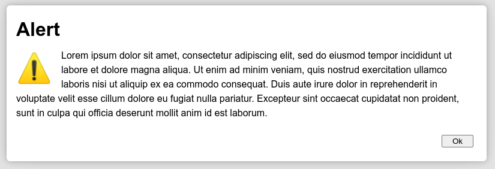
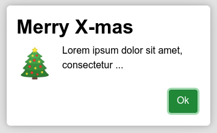

# simplydialogs
A small collection of standard dialogs: ```alert()```, ```confirm()```, ```error()```, ```information()``` and ```bell()```. Built with ES6 and unicode, utilizing the native ```<dialog>``` HTML element. Works in all modern browsers. Tested with Chrome, Opera, Firefox and Edge (Linux & Windows 10). Use simplydialogs if you just need some dialogs on a minimalistic webpage, or want a quick alternative to the builtin dialogs or modals provided by your favourite framework, like Bootstrap, Tailwind or similar.

* No dependencies; using native &lt;dialog> element and unicode</li>
* Truly blocking interaction with background
* Stays in center of viewport, adjusted to message size, stays in focus while scrolling
* Returns promises
* Support keyboard / mouse the right way
* Customizeable
* Neat exploding / imploding effect without exaggerating
* No forced styling (beyond very basics), adopts the current "theme"
* Small footprint, JS+CSS less than 10k

## Usage
Include the script and CSS

```html
<script src="path/to/simplydialogs/dist/dialogs.min.js"></script>
<link rel="stylesheet" type="text/css" href="path/to/simplydialogs/dist/dialogs.min.css">
```

That gives you a SimplyDialogs function. For convenience, create a shorthand alias 

```javascript
const Dlg = SimplyDialogs

Dlg.alert('Lorem ipsum dolor sit amet, consectetur adipiscing elit')
Dlg.error('Lorem ipsum dolor sit amet, consectetur adipiscing elit')
Dlg.confirm('Lorem ipsum dolor sit amet, consectetur adipiscing elit')
Dlg.info('Lorem ipsum dolor sit amet, consectetur adipiscing elit')
Dlg.bell('Lorem ipsum dolor sit amet, consectetur adipiscing elit')
```




## Change defaults
All dialogs have som basic defaults which can be altered

```javascript
let defaults = {
  headers: {
    alert: 'Alert',
    error: 'Error',
    confirm: 'Confirm',
    information: 'Information',
    bell: 'Notice'
  },
  icons: {
    alert: '⚠',
    error: '⛔',
    confirm: '✔️',
    information: '💡',
    bell: '🔔'
  },
  buttons: {
    captions: {
      ok: 'Ok',
      cancel: 'Cancel',
      yes: 'Yes',
      no: 'No'
    },
    classes: {
      ok: '',
      cancel: '',
      yes: '',
      no: ''
    }
  }
}
```
If you want to change the confirm yes/no buttons to for example something different in spanish:

```javascript
Dialogs.DEFAULTS.buttons.captions.yes = 'Aceptar'
Dialogs.DEFAULTS.buttons.captions.no = 'Cancelar'
```
If you want to use an fontawesome icon instead of the default unicode sign, for example a nicer information icon (here using bootstrap):

```javascript
Dialogs.DEFAULTS.icons.information = '<i class="fa fa-info-circle fa-lg text-primary"></i>'
```
If you want to show bootstrap buttons instead of neutral standard button

```javascript
Dialogs.DEFAULTS.buttons.classes.ok = 'btn btn-sm btn-success'
```

## Options on the fly
Changing defaults are global, if you just want to modify a dialog on the fly, you can pass options with the same structure as the defaults literal, only the desired differences are needed :

```javascript
Dlg.alert('Lorem ipsum dolor sit amet, consectetur ...', {
  headers: { alert: '<strong>Merry X-mas</strong>' },
  icons: { alert : '🎄' },
  buttons: {
    classes: {
      ok: 'btn btn-md btn-success'
    }
  }
})
```

