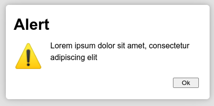
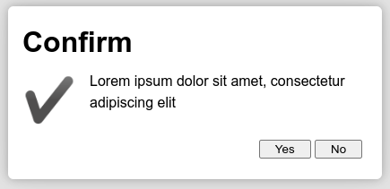
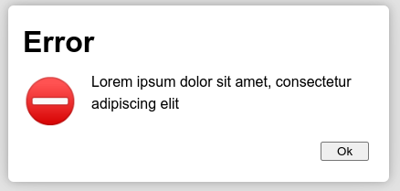
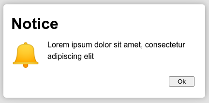
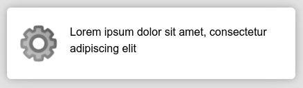
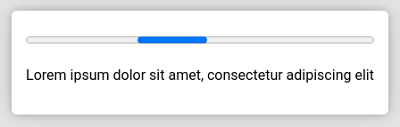
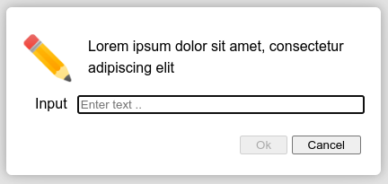

# SimplyDialogs

## Demos and documentation here → https://simplydialogs.github.io

A small collection of standard dialogs: ```alert()```, ```confirm()```, ```error()```, ```info()```, ```bell()```, ```wait()```, ```progress()``` and ```input()```. 
Built with ES6 and unicode, utilizing the native ```<dialog>``` HTML element. Works in all modern browsers. Tested with Chrome, Opera, Firefox and Edge.

Use SimplyDialogs if you just need some dialogs on a minimalistic webpage - or want a quick alternative to the built-in dialogs or modals provided by your favourite framework, like Bootstrap, Tailwind or similar. You can customize the layout so it get the look of your theme / framework. 

* No dependencies; using native ```<dialog>``` element and unicode</li>
* Truly blocking interaction with background
* Stays in focus while scrolling
* Return promises
* Support keyboard / mouse the *right* way
* Highly customizeable
* Stackable
* Neat exploding / imploding effect without exaggerating
* No forced styling (beyond very basics), adopts the current "theme"
* Very small footprint, JS + CSS > ~17.7kb minified (current version v1.1.0)

## Dialogs
<table>
<tr>
<th>Type</th>
<th>Sample</th>
<th>Remarks</th>
</tr>
<tr>
<td>

```alert()```

</td>
<td></td>
<td>

```javascript
Dlg.alert('Lorem ipsum ...')
Dlg.alert('Lorem ipsum ...', options)
```
Returns promise, ex: 
```javascript
Dlg.alert('Lorem ipsum ...').then(answer => { 
  console.log(answer) //true, false if closed with ESC
})
```
</td>
</tr>
<tr>
<td>

```information()```<br>```info()```

</td>
<td></td>
<td>

Same as ```alert()```

</td>
</tr>

<tr>
<td>

```confirm()```

</td>
<td></td>
<td>

```javascript
Dlg.confirm('Lorem ipsum ...').then(answer => { 
  console.log(answer) //true or false
})
```

</td>
</tr>

<tr>
<td>

```error()```

</td>
<td></td>
<td>

Same as ```alert()```

</td>
</tr>
<tr>
<td>

```bell()```

</td>
<td></td>
<td>

Same as ```alert()```

Produces a "beep"; if you not need the beep you can remove it from ```defaults```, i.e ```DEFAULTS.beep = undefined``` and save around 4k.  

</td>
</tr>
<tr>
<td>

```wait()```
</td>
<td></td>
<td>
Does not return a promise, instead some useful methods to interact with the dialog 

```javascript
const wait = Dlg.wait('Lorem ipsum ...')
//do something in code
wait.setText('alter the dialog message')
wait.addText('add something to the dialog message')
wait.close()
```
</td>
</tr>

<tr>
<td>

```progress()```
</td>
<td></td>
<td>
Does not return a promise, instead some useful methods to interact with the dialog 

```javascript
const progress = Dlg.progress('Lorem ipsum ...')
//do something in code
progress.setValue(42)
progress.setText('alter the dialog message')
progress.close()
```
</td>
</tr>

<tr>
<td>

```input()```
```prompt()```

</td>
<td></td>
<td>

By default just a prompt with a single text input :

```javascript
Dlg.input('Lorem ipsum ...').then(state) => {
 ... 
})
```
You can specify complex input forms 

```javascript
Dlg.input('Lorem ipsum ...', {
  input: {
    inputs: [
	  { type: 'input', inputType: 'text', label: 'Name', name: 'name' },
	  { type: 'input', inputType: 'number', label: 'Age', name: 'age' },
   ]}
}).then(state) => {
 ... 
})
```
You can add a callback to control the submit button
			
```javascript
callback: function(state, dialog) { 
  return state.name !== '' && state.age > 42
})
```

</td>
</tr>

</table>

## Usage
Include the script and CSS.

```html
<script src="dist/SimplyDialogs.min.js"></script>
<link rel="stylesheet" type="text/css" href="dist/SimplyDialogs.min.css">
```

Or refer to the ```.mjs``` version if you want to use SimplyDialogs as module 

```javascript
import { SimplyDialogs } from './dist/SimplyDialogs.min.mjs'
```

That makes a SimplyDialogs function available. For convenience, create a shorthand alias :

```javascript
const Dlg = SimplyDialogs
Dlg.alert('Lorem ipsum dolor sit amet')
Dlg.error('Lorem ipsum dolor sit amet')
Dlg.confirm('Lorem ipsum dolor sit amet')
Dlg.info('Lorem ipsum dolor sit amet')
Dlg.bell('Lorem ipsum dolor sit amet')

const wait = Dlg.wait('Lorem ipsum dolor sit amet')
setTimeout(function() {
  wait.close()
}, 2000)

const progress = Dlg.progress('Lorem ipsum dolor sit amet', { progress: { max: 100, value: 0 }})
let value = 0
const interval = setInterval(function() {
  value++
  progress.setValue(value)
  if (value === 100) {
    clearInterval(interval)
    progress.close()
  }
}, 50)


Dlg.input('Lorem ipsum dolor sit amet').then(formState => {
  console.log(formState)
})
```


